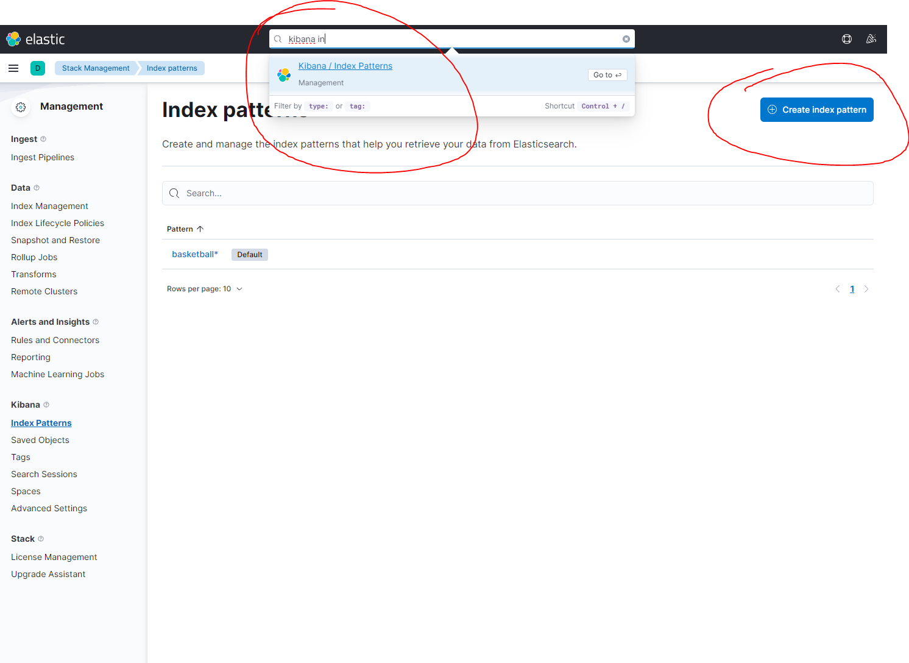
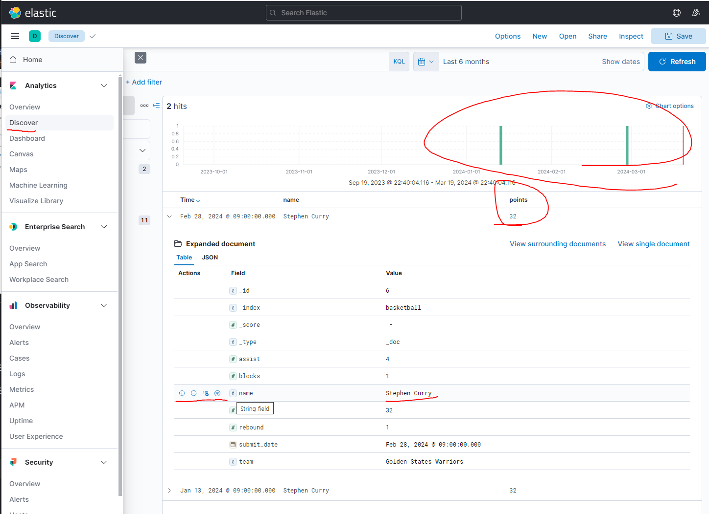
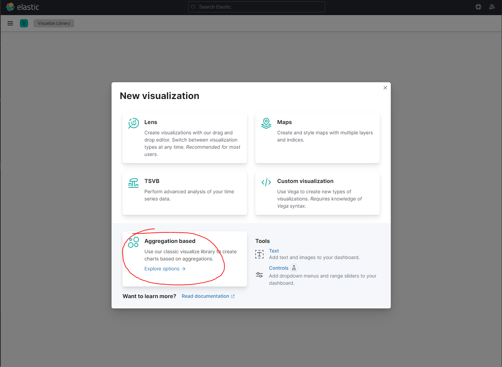
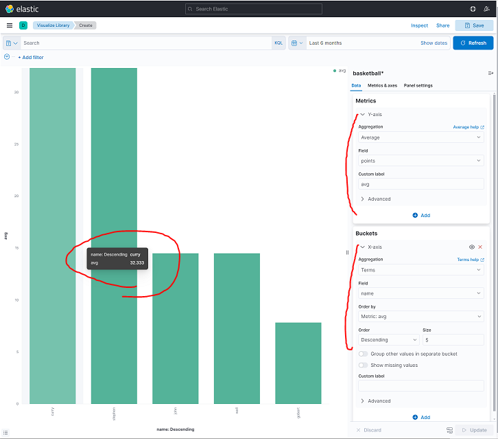
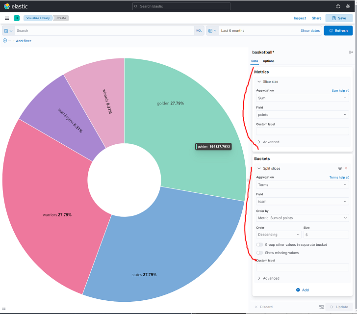
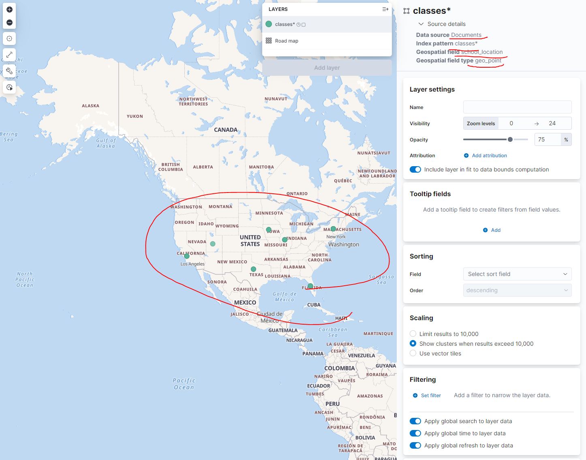
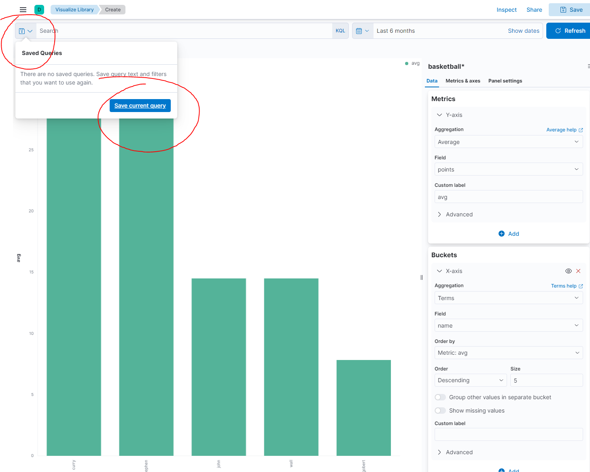

### 키바나 매니지먼트
- json파일 넣기, 6.0부터 타입 매핑 사라짐 record 제거, 날짜 수정
- localhost:5601 -> 엘라스틱에서 통합으로 바뀌어서 강의랑 다름
{: width="100" height="100"}
- create index pattern하여 생성
### 키바나 디스커버
- 디스커버는 다른 곳에 있음
{: width="100" height="100"}
### 키바나 비주얼라이즈: 막대그래프, 파이차트
- 메뉴

- 각 선수별 평균 점수

- 각 팀 점수

### 키바나 비주얼라이즈: 타일맵 지도에 표시
- 7.0이상 부터 string -> text, keyword로 변경

### 키바나 대시보드
- 저장된 비주얼라이즈는 대시보드에서 사용 가능
gi