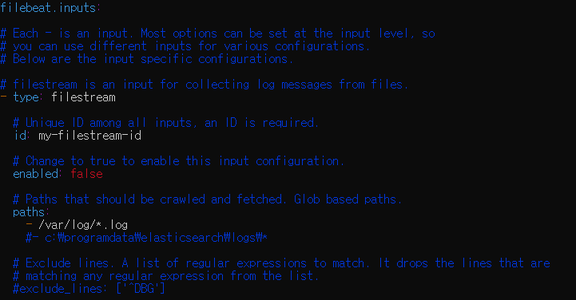
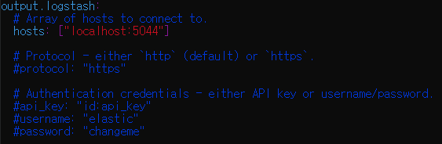

### 로그스태시로 실데이터 분석
- logstash-simple.conf

  - 위치: usr/share/logstash/bin
  - ~/: home이랑 사용자 까지 즉, home/vienna라는 뜻
- logstash.conf 
  - logstash.yml 경로 못찾는 에러 발생하여 --path 추가 작성: sudo ./ logstash -f ~/conf/logstash.conf --path.settings /etc/logstash

  - population index patterns 추가 하기 -> 디스커버리, 비주얼라이즈에서 분석해보기
  - stock index patterns 추가 하기 -> 디스커버리, 비주얼라이즈에서 분석해보기
### 파일비트로 분산 서버 로그 ELK 스택 전달하기
- logstash.yml
  - input output 설정하기
  - 변경전
  - 
  - 
  - 변경후
  - 
  - 
- logstash-filebeat.conf 추가
  - tomcat index patterns 추가 하기 -> 톰캣 여러대 로그를 한번에 볼 수 있음
#### 큐레이터로 디스크 공간 자동 관리
- 큐레이터 사용하려면 파이썬 필요 -> sudo apt-get install python3-pip -> pip install elasticsearch-curator
- create curator.yml
#### S3를 활용한 로그 백업 및 복원